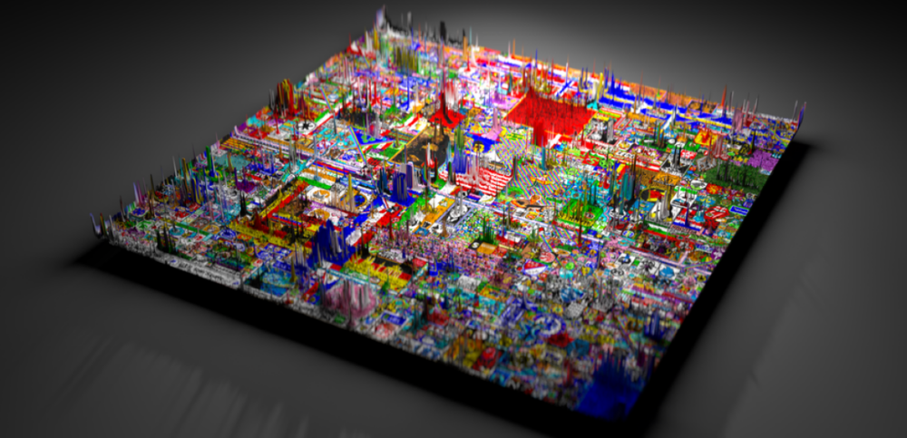
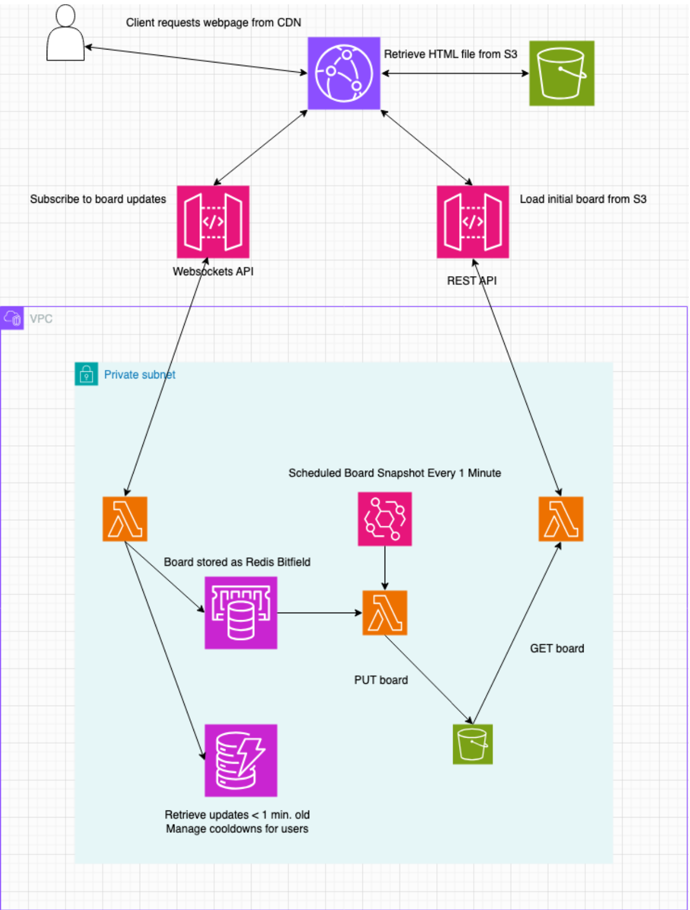

# pixel-party 

A web application where thousands of users can simultaneously paint pixels of a large canvas, with updates being broadcast to all users in real-time.

*r/place, the inspiration for this project*. See [How we built place](https://www.redditinc.com/blog/how-we-built-rplace) to get a glimpse into how one might build a system for millions of users. In this project, I added new performance optimizations beyond those described in the linked article.

## System Architecture 

The system's architecture comprises of the following AWS services 

* API Gateway - To deploy the WebSockets API.
* Lambda - Request handlers for the websockets API.
* S3 - Stores snapshots of the board for fault tolerance.
* CloudFront - For fast first-time loads of the entire board.
* CloudFormation - To achieve administrative scalability.
* DynamoDB - To retrieve incremental updates to the board (from within the last minute).
* ElastiCache (Redis configured with a t2.micro cache)
* VPC - To place a firewall in front of critical services.
* EventBridge scheduler - For scheduling snapshots of the board. 
* IAM 
* CloudWatch 

## Strengths 

**Scalability**: We can scale the number of request handlers without limit to meet demand for our WebSockets API.

**Administrative Scalability**: The desired state of resources is defined with a CloudFormation template. This template is used to create a stack that manages updates to these resources. 

**Low Latency**: The responses are fast because we retrieve the board from an in-memory cache (i.e. Redis).

**Availability**: The Lambda function is deployed in two availability zones. As availability zones are independent failure zones, this gives the solution added fault tolerance. In the event of a Redis cache failure, one can easily restore the board from the backup in DynamoDB. So a total loss of data is highly unlikely.

**Consistency**: A snapshot of the board is taken every minute. Thus, new clients will be at most a minute behind upon connecting.

